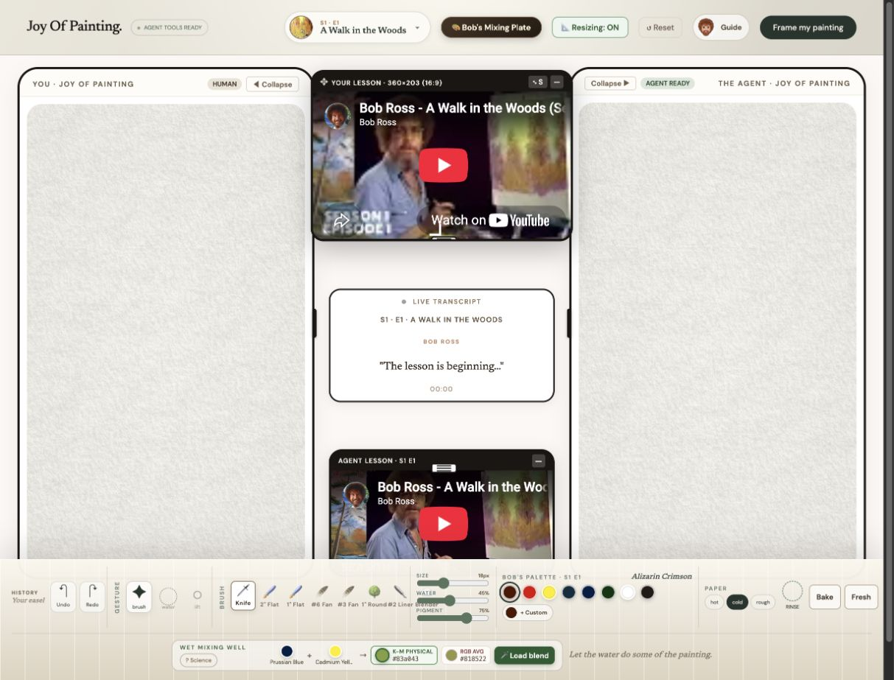
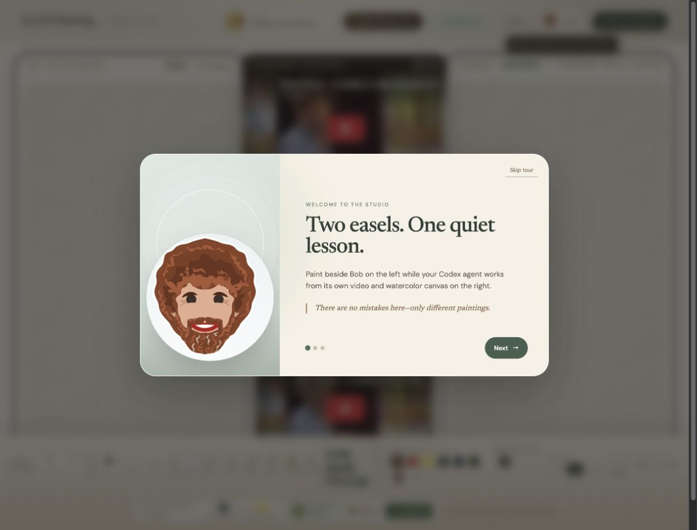

# Joy Of Painting

> A calm, collaborative Bob Ross paint-along studio for humans and AI agents.

[**Open the live studio**](https://bobross.prompthabbit.com/) · [**Watch the demo**](https://youtu.be/iROOJsNX920)



Joy Of Painting turns a Bob Ross lesson into a shared creative space. You paint on one HTML canvas while a Codex agent paints on another, each following the same episode through an independent YouTube player. The center transcript keeps the lesson’s current words close, and the interface stays quiet enough to let the painting lead.

## Demo

[](https://youtu.be/iROOJsNX920)

Click the image to watch the demo on YouTube.

## The studio

- WebGL watercolor simulation rendered directly on HTML canvas
- Separate human and agent easels with independent YouTube players
- Live, episode-aware transcript captions in the center of the studio
- Bob Ross episode browser with palette-aware pigments
- Water, pigment load, brush size, paper texture, lifting, rinsing, and drying controls
- Kubelka–Munk physical pigment mixing with an RGB comparison
- Custom reusable pigments, eyedropper support, undo, and redo
- Resizable and collapsible easels and lesson players
- Guided first-visit onboarding with reduced-motion support
- Export the human painting as a PNG



## Agent painting with WebMCP

The page registers a focused set of WebMCP tools so a compatible browser agent can work inside the same studio without taking over the human easel:

- `get_paint_along_status` — inspect the episode, caption, and canvas state
- `control_agent_lesson` — play, pause, and seek the agent’s video
- `read_live_lesson_transcript` — read the current caption and nearby context
- `get_agent_lesson_reference_image` — obtain the lesson reference thumbnail and timestamp
- `paint_agent_canvas` — place normalized watercolor strokes on the agent canvas
- `manage_agent_canvas` — dry, undo, redo, or clear the agent painting

## How it works

The interface is built with React and Vite. The painting engine uses WebGL2 textures for wet pigment, water flow, paper grain, diffusion, lifting, and dry glazing. A bounded shared GPU history provides undo and redo without allowing texture memory to grow indefinitely. YouTube playback uses `@videojs/react`, while WebMCP exposes the agent-safe controls.

## Run locally

```bash
pnpm install
pnpm dev
```

Create a production build with:

```bash
pnpm build
```

## Deploy

The production site is served by Cloudflare Workers with static assets and the custom domain configured in `wrangler.jsonc`.

```bash
pnpm deploy
```

## Philosophy

The studio follows the idea that painting is not a test to pass. It is a place to notice, experiment, and make happy little decisions—whether the brush belongs to a person or an agent.
